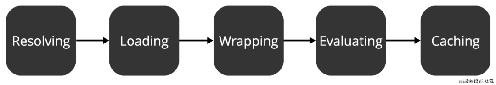

<!--
 * @Author: tangdaoyong
 * @Date: 2021-01-18 10:29:26
 * @LastEditors: tangdaoyong
 * @LastEditTime: 2021-01-18 11:38:30
 * @Description: 模块
-->

# 模块

[Nodejs 模块化](https://mp.weixin.qq.com/s/ovLl8jw1xBa1TwPSVwJQ_Q)

## 介绍

Node.js是基于`CommonJS`规范进行模块化管理的，模块化是面对复杂的业务场景不可或缺的工具。

在Node.js中，内置了两个模块来进行模块化管理，这两个模块也是两个我们非常熟悉的关键字：require和module。

引入模块：
```js
const config = require('/path/to/file')
```
引入模块实际执行了一共五个步骤：


了解这五个步骤有助于我们了解Node.js模块化的基本原理，也能让我们甄别一些陷阱，让我们简单概括下这五个步骤都做了什么：
* Resolving： 找到待引用的目标模块，并生成绝对路径。
* Loading： 判断待引用的模块内容是什么类型，它可能是.json文件、.js文件或者.node文件。
* Wrapping： 顾名思义，包装被引用的模块。通过包装，让模块具有私有作用域。
* Evaluating： 被加载的模块被真正的解析和处理执行。
* Caching： 缓存模块，这让我们在引入相同模块时，不用再重复上述步骤。

## 模块

命令行运行`node`切换到`node`环境，然后执行`module`则可以直观的看到`Module`的定义。
```js
$ node                    
> module
Module {
  id: '<repl>',
  exports: {},
  parent: undefined,
  filename: null,
  loaded: false,
  children: [],
  paths:
   [ '/Users/matias/matias_github/matias-node/repl/node_modules',
     '/Users/matias/matias_github/matias-node/node_modules',
     '/Users/matias/matias_github/node_modules',
     '/Users/matias/node_modules',
     '/Users/node_modules',
     '/node_modules',
     '/Users/matias/.node_modules',
     '/Users/matias/.node_libraries',
     '/usr/local/lib/node' ] }
> 
```

### Resolving

### Loading

#### exports

#### module.exports

#### 模块是同步加载

`CommonJS`是`运行时``同步`加载。

#### 查看require所支持的文件类型

`node`环境下执行：
```js
> require.extensions
[Object: null prototype] { '.js': [Function], '.json': [Function], '.node': [Function] }
```

### Wrapping

Node.js模块中，在一个模块中定义的变量具有**私有作用域**，在其它模块中无法直接访问。是因为在编译模块之前，Node.js将模块中的内容包装在了一个function中，通过函数作用域实现了私有作用域。

通过require('module').wrapper可以打印出wrapper属性：
```js
> require('module').wrapper
Proxy [ [ '(function (exports, require, module, __filename, __dirname) { ',
    '\n});' ],
  { set: [Function: set],
    defineProperty: [Function: defineProperty] } ]
```
这个包装函数有五个参数：exports, require, module, __filename, __dirname。我们可以通过arguments参数直接访问和打印这些参数：
```js

```

简单了解一下这几个参数，第一个参数exports初始时为空（未赋值），第二、三个参数require和module是和我们引用的模块相关的实例，它们俩不是全局的。第四、五个参数__filename和__dirname分别表示了文件路径和目录。

整个包装后的函数所做的事儿约等于：
```js
function (require, module, __filename, __dirname) {
  let exports = module.exports;
  
  // Your Code...
  
  return module.exports;
}
```

### Evaluating

### Caching

打印require.cache可以看到当前的缓存信息：
```js

```